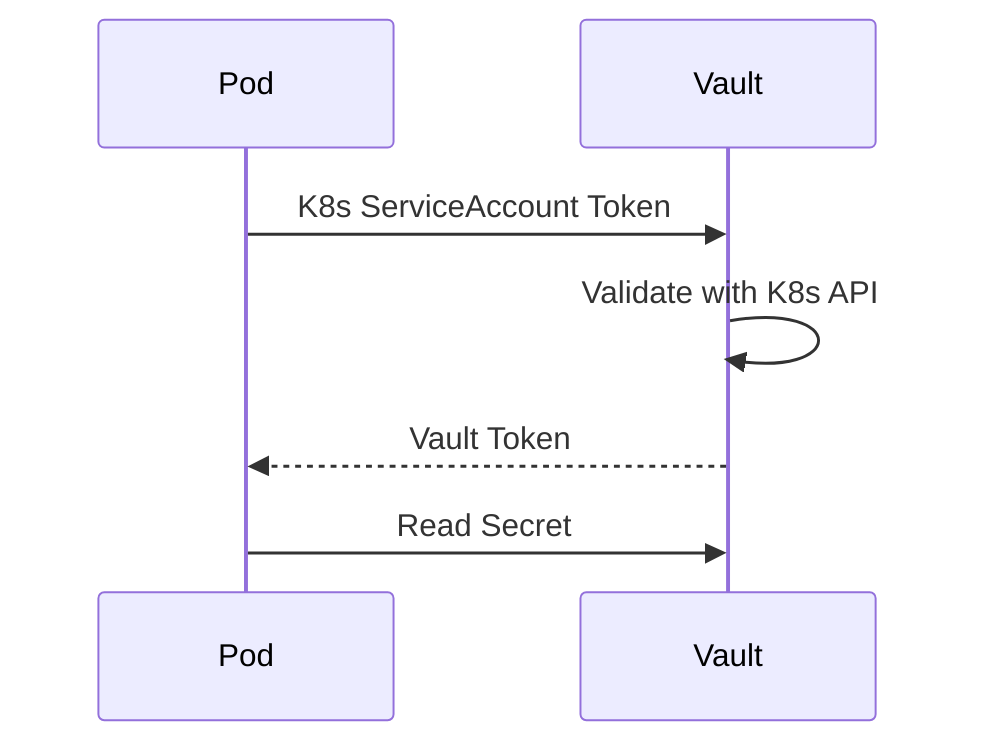

# Architecture: Cloud-Native Secrets & Identity
> Maturity: Lab / Reference Implementation

## System Diagram
The following Mermaid.js sequence diagram maps the core workflow and interactions:

## The Problem with Static Credentials
Historically, CI/CD pipelines required a `client_secret` stored in GitHub Actions to authenticate to Azure/AWS. If that secret leaked, attackers had persistent access to the cloud environment. Similarly, Kubernetes pods required `secrets` mounted into them containing database passwords. These secrets were often checked into Git repositories, leading to massive breaches.

## The Zero-Trust Identity Architecture

### 1. GitHub Actions OIDC (OpenID Connect)
Instead of storing an Azure password in GitHub, we configure an Azure App Registration to trust GitHub's OIDC provider. When a GitHub Action runs, it requests a JWT (JSON Web Token) from GitHub, which includes cryptographic proof of the repository name and branch. The Action presents this token to Azure. Azure verifies the signature, sees that it's from the trusted `main` branch of `my-org/my-repo`, and grants a temporary access token valid for 1 hour. **No secrets to rotate, no secrets to leak.**

### 2. Azure Workload Identity for AKS
Similarly, pods inside Kubernetes should not have hardcoded credentials to access Azure Key Vault. Using Azure Workload Identity, a Kubernetes `ServiceAccount` is federated to an Azure Managed Identity. When the External Secrets Operator pod starts, it requests an Azure token using its Service Account identity.

### 3. External Secrets Operator (ESO)
ESO acts as a bridge. It uses its Workload Identity to connect to Azure Key Vault, fetches the requested secrets (like database passwords), and dynamically writes them into the Kubernetes cluster as native `Secret` objects. Applications simply mount these K8s Secrets as normal. If the DB password changes in Key Vault, ESO automatically rotates the K8s Secret within the configured `refreshInterval`.
